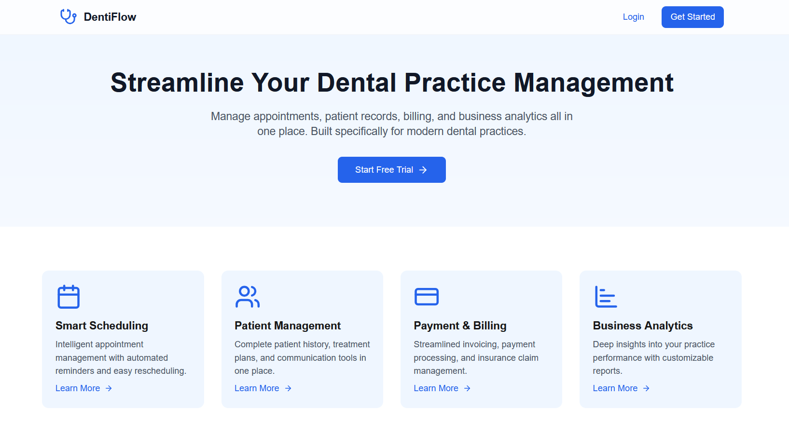
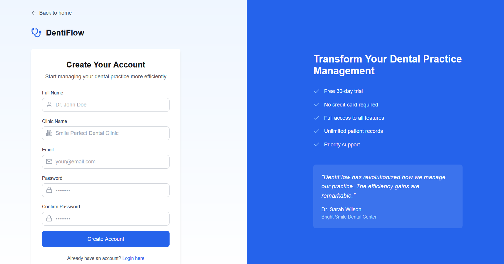
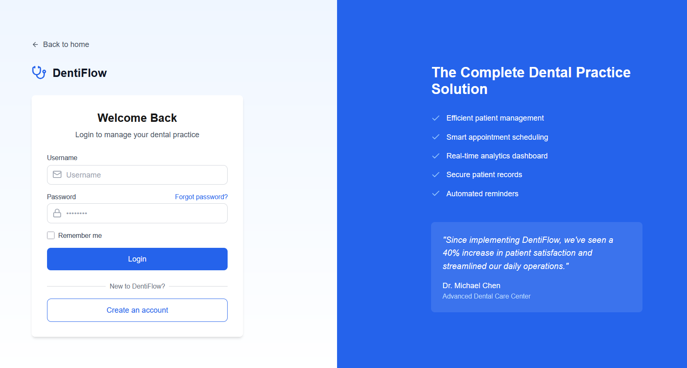
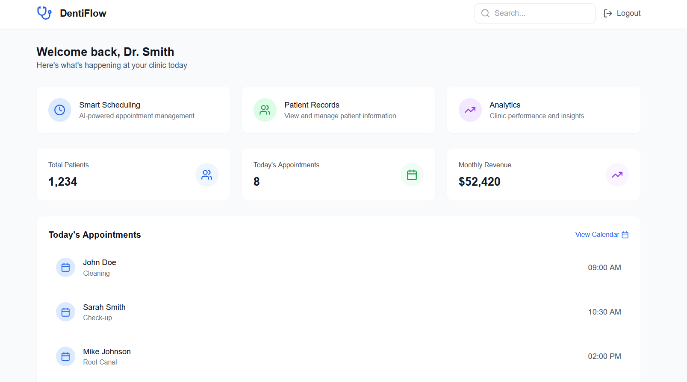
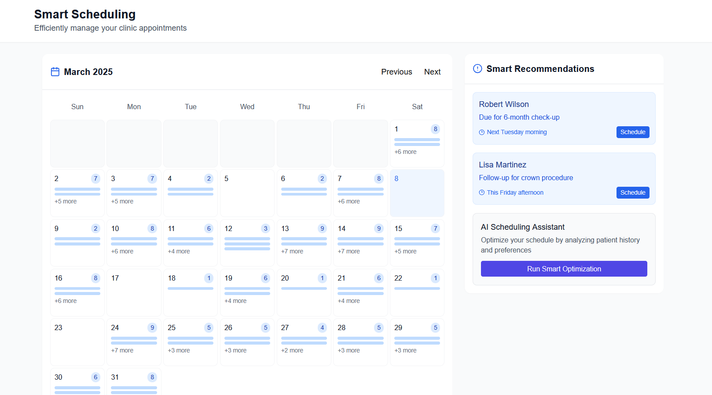
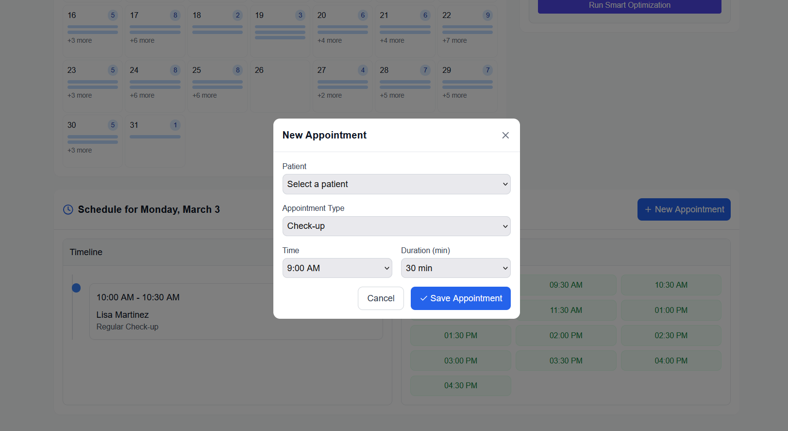
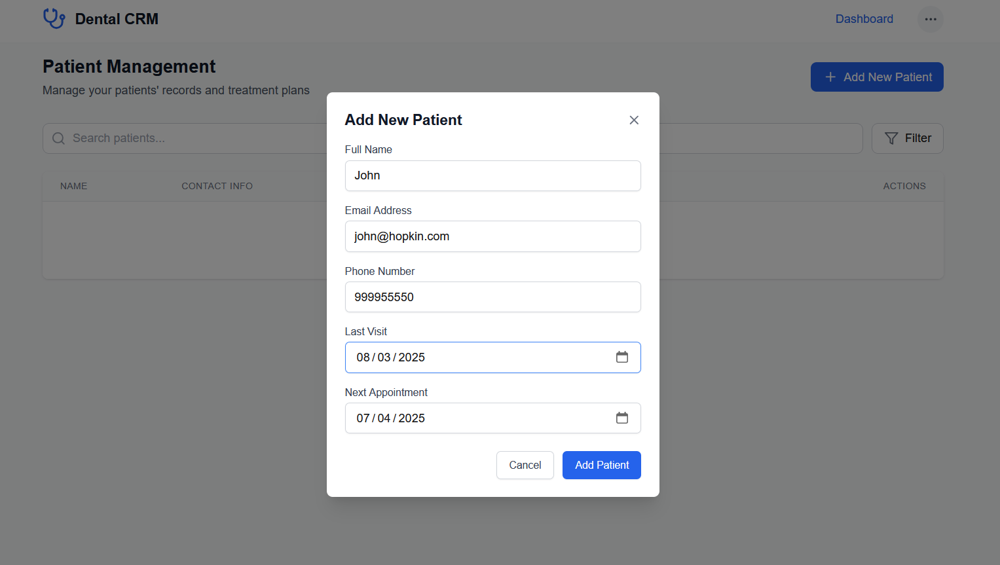
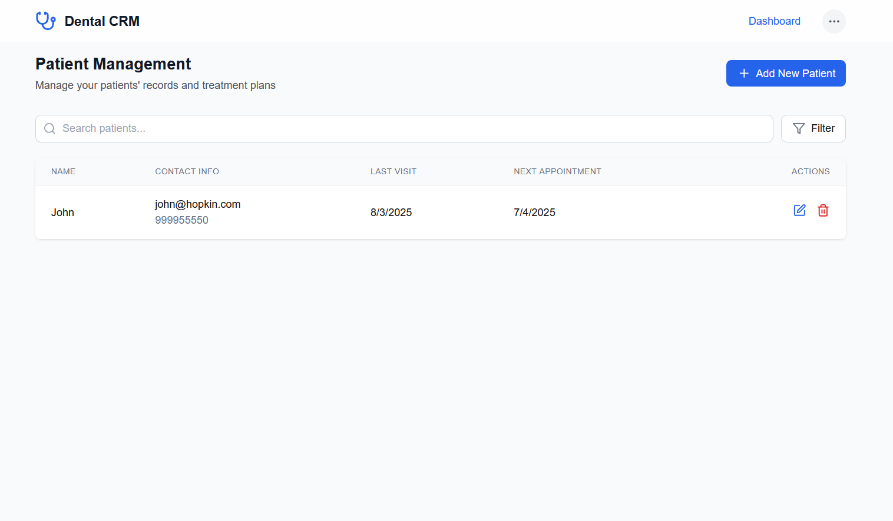
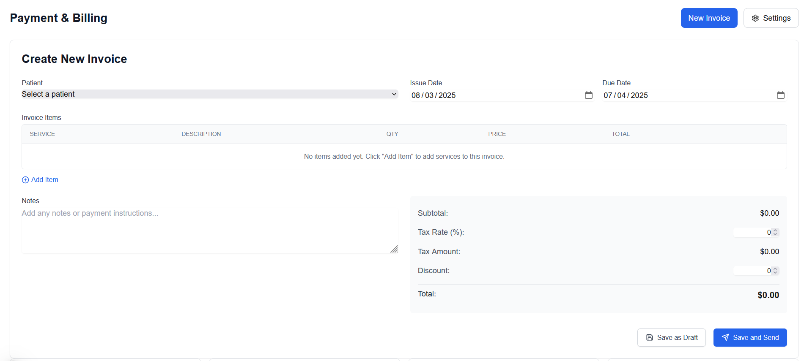
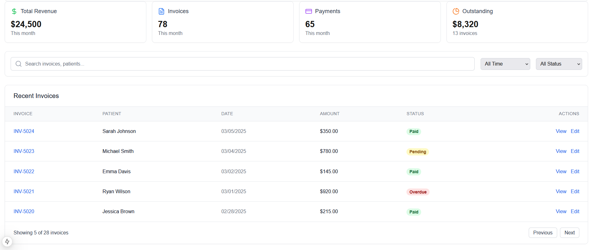

   

# 
 DentiFlow: Patient & Appointment Management System 

   

✅ Doctor Registration – Simple Register and Login Feature.  

   

   

✅ Doctor Dashboard – Doctors can view patient histories, manage appointments, and update treatment plans.

   

✅ Smart Scheduling- AI based smart scheduling algorithm to suggest vacant timing and Appoinent bookin.

   

✅ Appointment Booking – Patients or staff can book, reschedule, and cancel appointments.

   

✅ Patient Mangement - Staff can add details of new patient and have access to records

   

   

✅ Billing - Stafs can manage billing of different patients and send reminder in real time.

   

   

📈 Real-time Updates – Instant updates on appointments and patient records.
   
